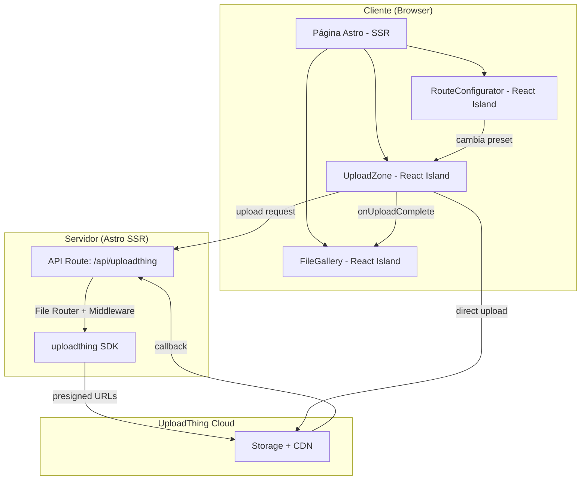

# Arquitectura — UploadThing Demo

## Stack elegido

**Astro 6 + React islands.** Justificación:

- La demo es una sola página con secciones mayoritariamente estáticas (textos explicativos, banners, sección de stack) y tres componentes interactivos (uploader, galería, configurador).
- Astro renderiza el HTML estático en servidor y solo hidrata los componentes React que necesitan interactividad (`client:load`).
- UploadThing tiene documentación oficial para Astro con soporte para inyección de router config desde SSR.
- Las API routes de Astro (modo `hybrid` o `server`) permiten montar el endpoint `/api/uploadthing` sin exponer el token en cliente.
- El usuario ha pedido explícitamente Astro para variar respecto a las demos anteriores con Next.js.

**¿Por qué no Next.js?** No hay estado complejo entre páginas, no hay autenticación, no hay data fetching dinámico. Astro es más ligero para este caso.

## Diagrama de componentes



## Estructura de carpetas

```
uploadthing-concriterio-tools/
├── src/
│   ├── components/
│   │   ├── UploadZone.tsx          # Componente React de upload (drag & drop + progreso)
│   │   ├── FileGallery.tsx         # Galería de archivos subidos en sesión
│   │   ├── RouteConfigurator.tsx   # Selector de presets de File Route
│   │   ├── Banners.astro           # Banners fijos (consultoría, newsletter, repo)
│   │   └── StackSection.astro      # Sección de stack tecnológico
│   ├── layouts/
│   │   └── Layout.astro            # Layout base con fuentes y meta tags
│   ├── pages/
│   │   ├── index.astro             # Página principal
│   │   └── api/
│   │       └── uploadthing.ts      # API route que monta el handler de UploadThing
│   ├── server/
│   │   └── uploadthing.ts          # Definición de File Routes
│   └── styles/
│       └── global.css              # Import de Tailwind + custom tokens
├── docs/
│   ├── prd.md
│   ├── architecture.md
│   ├── design-system.md
│   └── roadmap.md
├── public/
│   └── favicon.svg
├── astro.config.mjs
├── tsconfig.json
├── package.json
├── .env.example
├── README.md
└── CLAUDE.md
```

## Integraciones externas

| Servicio | Propósito | SDK/Método |
|----------|-----------|------------|
| UploadThing | Upload, storage, CDN | `uploadthing` v7.7.4 + `@uploadthing/react` v7.3.3 |

No hay otras integraciones externas. Sin base de datos, sin auth provider.

## Estrategia de protección de API keys

- `UPLOADTHING_TOKEN` — Variable de entorno del servidor. Nunca expuesta en cliente.
- El endpoint `/api/uploadthing` corre en el servidor de Astro (SSR). El SDK lee el token automáticamente desde `process.env.UPLOADTHING_TOKEN`.
- En cliente, el componente `<UploadButton>` / `useUploadThing()` se comunica con `/api/uploadthing` en tu propio servidor. UploadThing genera presigned URLs y el upload va directo del browser al CDN de UploadThing — el archivo nunca pasa por tu servidor.
- Para SSR del router config, se usa `extractRouterConfig()` en el componente Astro server-side y se inyecta vía `globalThis.__UPLOADTHING` para evitar un fetch adicional desde cliente.

## Configuración de Astro

```javascript
// astro.config.mjs
import { defineConfig } from "astro/config";
import react from "@astrojs/react";
import tailwindcss from "@tailwindcss/vite";
import vercel from "@astrojs/vercel";

export default defineConfig({
  output: "server",
  adapter: vercel(),
  integrations: [react()],
  vite: {
    plugins: [tailwindcss()],
  },
});
```

- `output: "server"` — necesario para las API routes que maneja UploadThing.
- `@astrojs/react` — para los islands interactivos.
- `@tailwindcss/vite` — Tailwind 4 via plugin Vite (el método recomendado; `@astrojs/tailwind` está deprecated).
- `@astrojs/vercel` — adapter de deploy.

## Configuración de Vercel

- Framework preset: Astro
- Variables de entorno: `UPLOADTHING_TOKEN`
- Node.js version: 22.x
- No requiere configuración adicional. El adapter de Astro se encarga del build.
